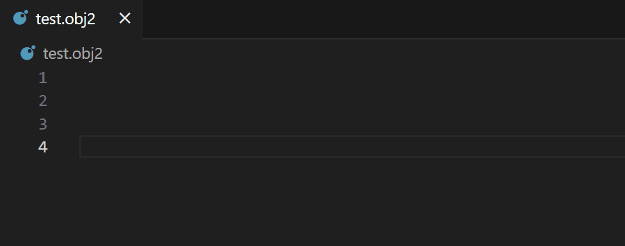
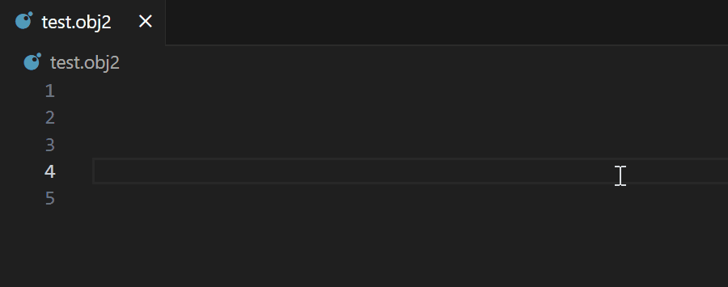
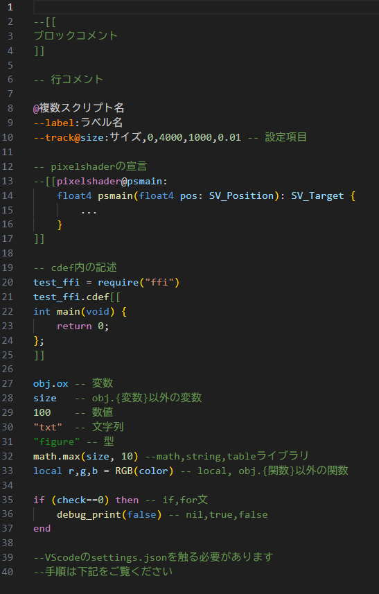
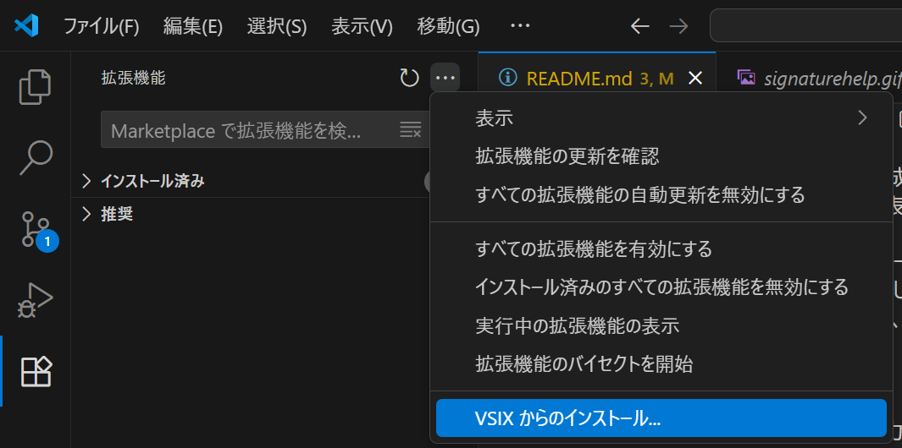

# AviUtl2-IntelliSense
AviUtl2のスクリプトファイル作成を補助するVScode用の拡張機能です。<br>
Snippets,SignatureHelp,候補表示などのコード補完機能があります。
> [!IMPORTANT]
> この拡張機能はいまのところベータ版として公開しています。<br>
不具合のご指摘やご要望がございましたら、このリポジトリのissuesやDMなどにてお知らせください。

## 機能紹介
### Snippets
設定項目(`--value@`など)の入力を補助するものです。<br>
`--`を省略して項目を入力しTabキーを押すと、設定項目のひな形が生成されます。


### SignatureHelp
設定や関数の各項目の形式を表示します。<br>
関数入力時には現在入力中の項目がハイライト表示され、説明も出てきます。
<br>

### 候補表示
入力した文字によって設定項目や関数、変数の予測候補が表示されます。<br>
<br>
> [!TIP]
> これらの機能は特定の文字(`@,--,.`など)を入力することにより作動する仕組みになっています。<br>
入力時以外に表示させたり、万が一表示されなかったりする場合は、`Ctrl+Shift+Space`で手動で表示させることもできます。
>
### Syntax Highlight(v0.3.0からの新機能)
ソースコードを属性に応じて着色し、視認性を上げます。<br>
<br>
**↓VScodeの設定(settings.json)を編集する方法**<br>
<br>
> [!IMPORTANT]
> この機能はVScodeそのものの環境設定も変更する必要があります。<br>
> 上のアニメーションgifも参考に、下記の手順に従って変更してください。<br>
>VScodeを開き、設定マーク(左下)→設定、もしくは`Ctrl+,`で設定を表示したのち、<br>
>ユーザー(vscode全体)の設定かワークスペースの設定の、編集したい方を選択し<br>
>右上にある「設定(JSONを開く)」を押してください。<br>
>開いたjsonファイルに下記のコードを追加してください。
```
"editor.tokenColorCustomizations": {
    "textMateRules": [
      {
        "scope": "aul2.settings.lua", //設定項目(--check@など)への着色
        "settings": {
          "foreground": "#FF8800"
        }
      },
      {
        "scope": "aul2.functions.lua", //関数(obj.drawなど)への着色
        "settings": {
          "foreground": "#FFD700"
        }
      },
      {
        "scope": "aul2.variable.lua", //変数(obj.oxなど)への着色
        "settings": {
          "foreground": "#87CEFA"
        }
      },
      {
        "scope": "aul2.variable.inside.lua", //関数内の引数への着色
        "settings": {
          "foreground": "#87CEFA"
        }
      },
      {
        "scope": "aul2.type.lua", //関数内の型("figure"など)への着色
        "settings": {
          "foreground": "#228B22"
        }
      }
    ]
  }
```
>"foreground":につづくカラーコードを変更することで、ご自身でお好みの色に変更可能です。

## 導入方法
1.Releasesから最新のバージョンの`.vsix`をダウンロードしてください。<br>
2.VScodeを立ち上げ、拡張機能メニューの上部にあるボタンを押し、「VSIXからのインストール」を選択してください。<br>
<br>
3.ダイアログでダウンロードしたvsixファイルを選択してください。<br>
**これで完了です。お疲れさまでした！**<br>
> [!TIP]
> VScodeのターミナルからも導入ができます。<br>
`cd`でvsixがダウンロードされている場所に飛んだあと、<br>
`code --install-extension aul2-intellisense-x.x.x.vsix`を実行してください。
> バージョンを戻す時には、上記のコマンドに`--force`を足して実行してください
## アンインストール方法
ほかの拡張機能と同様に、拡張機能のメニューからAviUtl2 IntelliSenseを選び、「アンインストール」を選択してください。
