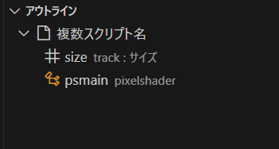

# AviUtl2-IntelliSense-Fork

Hirokawa-beachさんの[AviUtl2-IntelliSense](https://github.com/hirokawa-beach/AviUtl2-IntelliSense)のフォーク版です。v0.3.0をフォークしています。<br>
主にSyntax Highlight部分を変更しています。


## 機能紹介
元の機能に加えて、以下の2点が改変・追加されています。

### 1. Syntax Highlight
ソースコードが以下のように着色されます。<br>


> [!IMPORTANT]
> Syntax Highlightの導入にはVScodeそのものの環境設定も追加する必要があります。<br>
> 追加方法は[後述の記載](#2-vscodeの設定追加)を参照してください。

### 2. シンボルの追加 (v0.4.0~)
Aviutl2独自の設定項目について、シンボルを追加し、<br>
アウトライン欄での表示やシンボル検索ができるようになります。<br>




## 導入方法(フォーク元と同様)

### 1. 拡張機能の導入
1. Releasesから最新のバージョンの`.vsix`をダウンロードしてください。<br>
2. VScodeを立ち上げ、拡張機能メニューの上部にあるボタンを押し、「VSIXからのインストール」を選択してください。<br>
<br>
3. ダイアログでダウンロードしたvsixファイルを選択してください。<br>

> [!TIP]
> VScodeのターミナルからも導入ができます。
> `cd`でvsixがダウンロードされている場所に飛んだあと、
> `code --install-extension aul2-intellisense-fork-x.x.x.vsix`を実行してください。
> バージョンを戻す時には、上記のコマンドに`--force`を足して実行してください


### 2. VScodeの設定追加


1. VScodeを開き、設定マーク(左下)→設定、もしくは`Ctrl+,`で設定を表示してください。
2. ユーザー(vscode全体)の設定かワークスペースの設定の、編集したい方を選択してください。
3. 右上にある「設定(JSONを開く)」を押してください。
4. 開いたjsonファイルに下記のコードを追加してください。

```
"editor.tokenColorCustomizations": {
  "textMateRules": [
    {
      "scope": "aul2.settings.lua", //設定項目(--check@など)への着色
      "settings": {"foreground": "#FF8800"}
    },
    {
      "scope": "aul2.variable.lua", //変数(obj.oxなど)への着色
      "settings": {"foreground": "#87CEFA"}
    },
    {
      "scope": "aul2.type.lua", //型("figure"など)への着色
      "settings": {"foreground": "#228B22"}
    }
  ]
}
```
> "foreground":につづくカラーコードを変更することで、ご自身でお好みの色に変更可能です。

> [!IMPORTANT]
> Syntax Highlightの導入にはこの設定をする必要があります。

**これで完了です。お疲れさまでした！**


## アンインストール方法(フォーク元と同様)
ほかの拡張機能と同様に、拡張機能のメニューからAviUtl2 IntelliSense Forkを選び、<br>
「アンインストール」を選択してください。


## 機能詳細

### 追加した主なSyntax Highlight
- `local`, `function`, `if`文, `for`文
- `math`, `string`, `table`ライブラリ
- `pixelshader`, `computeshader`の定義部分, `{変数}.cdef`部分
- `obj.{関数}`以外の追加関数(ex:`RGB()`)
- ブロックコメント
- 旧スクリプト形式の一部(`--track0,1,2,3`, `--check0`, `--dialog`)
- 文字列, 数値, `obj.{変数}`以外の変数(アルファベット&数字&_で構成された単語)

### 変更点・修正点
- `--label`, `--script`, `--information`が着色されるように修正
- 変数(ex:`obj.ox`), 関数内の型(ex:`"figure"`)の着色対象範囲をファイル全体に変更
- `obj.setoption`, `obj.pixelshader`, `obj.computeshader`を着色対象に追加
- `obj.rotation`,`obj.degug_print`を`rotation`,`debug_print`に修正
- `obj.{変数}`の色をやや濃い青色に変更
- VScodeのsetting.jsonで設定する項目を`aul2.settings.lua`, `aul2.variable.lua`, `aul2.type.lua`の3つに削減

### 追加した機能
- Aviutl2の独自設定項目のシンボル追加

## Credits
```
MIT License

Copyright (c) 2025 hirokawa-beach

Permission is hereby granted, free of charge, to any person obtaining a copy
of this software and associated documentation files (the "Software"), to deal
in the Software without restriction, including without limitation the rights
to use, copy, modify, merge, publish, distribute, sublicense, and/or sell
copies of the Software, and to permit persons to whom the Software is
furnished to do so, subject to the following conditions:

The above copyright notice and this permission notice shall be included in all
copies or substantial portions of the Software.

THE SOFTWARE IS PROVIDED "AS IS", WITHOUT WARRANTY OF ANY KIND, EXPRESS OR
IMPLIED, INCLUDING BUT NOT LIMITED TO THE WARRANTIES OF MERCHANTABILITY,
FITNESS FOR A PARTICULAR PURPOSE AND NONINFRINGEMENT. IN NO EVENT SHALL THE
AUTHORS OR COPYRIGHT HOLDERS BE LIABLE FOR ANY CLAIM, DAMAGES OR OTHER
LIABILITY, WHETHER IN AN ACTION OF CONTRACT, TORT OR OTHERWISE, ARISING FROM,
OUT OF OR IN CONNECTION WITH THE SOFTWARE OR THE USE OR OTHER DEALINGS IN THE
SOFTWARE.
```

## Change Log

### 0.1.0
- AviUtl2 Beta8 の公開に伴い、SignatureHelp, SyntaxHighlightに`obj.putpixel`, `obj.copypixel`を追加

### 0.2.0
- AviUtl2 Beta12の公開に伴い、Snippets, SignatureHelp, SyntaxHighlightに`--text@`の項目を追加
- AviUtl2 Beta13の公開に伴い、SignatureHelp, SyntaxHighlightに`obj.getpixeldata`, `obj.putpixeldata`を追加

### 0.3.0
- Avitul2 Beta14の公開に伴い、SignatureHelp, Syntax Highlightに`obj.id`を追加
- AviUtl2 Beta15の公開に伴い、SignatureHelp, Syntax Highlightに`obj.module`を追加

### 0.4.0
- AviUtl2 Beta16-19の変更内容に対応
- `obj.draw()`などの関数の注釈が表示されるように変更
- Syntax Highlightを整理（結果に変化はなし）
- Aviutl2の独自設定項目のシンボルを追加
